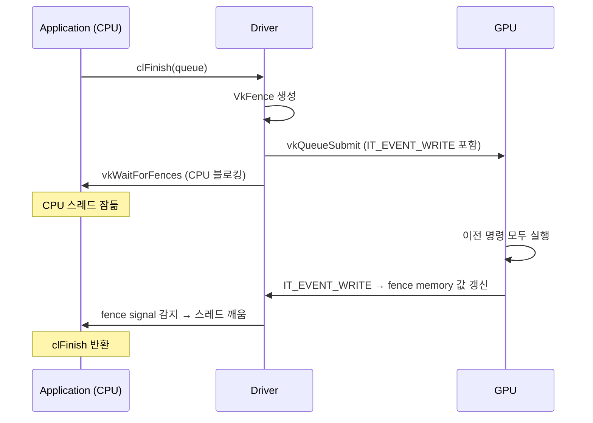
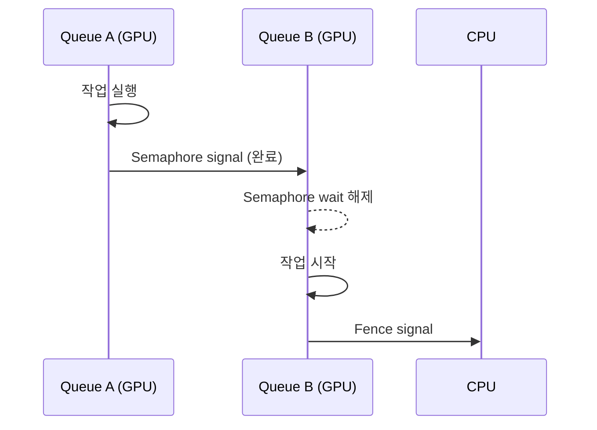

`clFinish(queue)` — "큐의 모든 명령이 끝날 때까지 기다려라." 한 줄짜리 API지만, 내부에서는 Vulkan Fence, PM4 EVENT_WRITE, OS 대기 기본 요소들이 연쇄적으로 동작한다.

---



## 전체 흐름

```
clFinish(queue)
  │
  ├─ ANGLE: vkQueueSubmit + VkFence 생성
  │         IT_EVENT_WRITE 패킷 ring buffer에 삽입
  │
  ├─ GPU: 모든 이전 명령 실행
  │       IT_EVENT_WRITE → fence memory 값 갱신
  │
  └─ CPU: vkWaitForFences → OS가 대기
          fence 값 변경 감지 → 스레드 재개
```

---

## 각 동기화 기본 요소

### Fence — CPU가 GPU 완료를 기다릴 때

```c
// Vulkan fence 흐름
VkFence fence;
vkCreateFence(device, &fenceInfo, NULL, &fence);

vkQueueSubmit(queue, 1, &submitInfo, fence);  // GPU 작업 제출 + fence 연결

vkWaitForFences(device, 1, &fence, VK_TRUE, UINT64_MAX);  // CPU 블로킹 대기
// ← 여기서 CPU 스레드가 잠든다 (OS 레벨 대기)
// GPU가 완료하면 fence에 signal → OS가 스레드 깨움
```

`clFinish`는 내부적으로 이 패턴을 사용한다.



### Semaphore — GPU와 GPU 사이 동기화

Fence가 CPU-GPU 사이라면, Semaphore는 **GPU Queue와 Queue 사이**다.

```c
// VkSemaphore: Queue A 완료 후 Queue B 시작
vkQueueSubmit(queueA, 1, &submitA, VK_NULL_HANDLE);  // signal semaphore

VkSubmitInfo submitB = {
    .waitSemaphoreCount = 1,
    .pWaitSemaphores = &semaphore,    // queueA가 signal할 때까지 대기
    .pWaitDstStageMask = &waitStage,
};
vkQueueSubmit(queueB, 1, &submitB, fence);
```



### Event — 파이프라인 내부의 세밀한 동기화

`VkEvent`는 Fence/Semaphore보다 세밀하다. 파이프라인 내부의 특정 스테이지가 끝났는지를 체크한다.

```c
vkCmdSetEvent(cmdBuf, event, VK_PIPELINE_STAGE_COMPUTE_SHADER_BIT);
// ... 다른 명령들 ...
vkCmdWaitEvents(cmdBuf, 1, &event,
    VK_PIPELINE_STAGE_COMPUTE_SHADER_BIT,   // src
    VK_PIPELINE_STAGE_COMPUTE_SHADER_BIT,   // dst
    ...);
```

---

## IT_EVENT_WRITE — PM4 수준에서 무슨 일이 일어나는가

`clFinish` → `vkQueueSubmit` → 드라이버가 ring buffer에 `IT_EVENT_WRITE` 패킷을 삽입한다.

```
IT_EVENT_WRITE 패킷:
  Header: Type=3, Opcode=0x46, Count=3
  EVENT_TYPE: CACHE_FLUSH_AND_INV  ← 캐시 flush + invalidate
  ADDRESS_LO: fence 메모리 주소 하위 32bit
  ADDRESS_HI: fence 메모리 주소 상위 32bit
```

GPU CP가 이 패킷을 처리하면:
1. 이전 모든 명령의 메모리 쓰기가 flush된다
2. 지정한 메모리 주소에 완료 값을 쓴다
3. CPU는 이 메모리 주소를 polling하거나 OS interrupt로 감지한다

---

## 세 가지 동기화 기본 요소 비교

| | Fence | Semaphore | Event |
|--|-------|-----------|-------|
| **대상** | CPU ↔ GPU | GPU ↔ GPU (Queue 간) | GPU 내부 (파이프라인 내) |
| **세밀도** | submit 단위 | submit 단위 | stage 단위 |
| **CPU 블로킹** | O (vkWaitForFences) | X | X |
| **OpenCL 대응** | clFinish, clWaitForEvents | (없음, 내부 처리) | clSetUserEventStatus |
| **PM4 패킷** | IT_EVENT_WRITE | IT_RELEASE_MEM | IT_EVENT_WRITE |

---

## OpenCL 관점 정리

| OpenCL API | 내부 동작 |
|------------|----------|
| `clFinish(queue)` | VkFence + vkWaitForFences (CPU 블로킹) |
| `clFlush(queue)` | vkQueueSubmit (제출만, 대기 없음) |
| `clWaitForEvents(events)` | VkEvent 또는 Fence의 조합 |
| `clEnqueueBarrierWithWaitList` | vkCmdPipelineBarrier |

---

## 관련 글

- [vkCmdPipelineBarrier 깊이 파기](/vulkan-pipeline-barrier/) — GPU 내부 순서 보장
- [PM4 Indirect Buffer](/pm4-indirect-buffer/) — IT_EVENT_WRITE가 IB와 어떻게 함께 쓰이는가
- [PM4 제출 흐름](/pm4-submit-flow-animation/) — ring buffer에 IT_EVENT_WRITE가 어떻게 들어가는가

## 관련 용어

[[command-queue]], [[command-buffer]], [[ring-buffer]], [[pm4-packet]]
