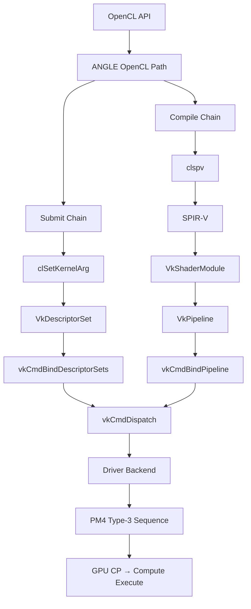

이 문서는 앞으로 어떤 순서로, 어떤 산출물을 만들어가는지 보여주는 **학습 지도**다.  
개별 노트는 이 지도의 한 칸씩을 채워가는 방식이다.

---

## 전체 흐름도

---

## 단계별 학습 산출물

### Phase 1 — 기초 (beginner)

| 단계 | 산출물 | 확인 방법 |
|------|--------|---------|
| API 라이프사이클 | 8개 객체 역할 표 | [객체 라이프사이클](/opencl-note-lifecycle/) |
| Build/캐시 경계 | 3-path 분류 (source/binary/cache) | [Build/캐시 경계](/opencl-note-build-cache/) |
| SPIR-V 읽기 | 5-point 관찰 체크리스트 | [SPIR-V 최소 읽기법](/opencl-note-spirv-reading/) |
| clspv 실전 | vector_add 인자 ↔ binding 대응표 | [clspv 실전](/opencl-note-clspv-practice/) |
| Vulkan 매핑 | SPIR-V → Vulkan 1:1 대응 코드 | [SPIR-V↔Vulkan 매핑](/opencl-note-spirv-vulkan-mapping/) |

### Phase 2 — 중급 (intermediate)

| 단계 | 산출물 | 확인 방법 |
|------|--------|---------|
| ANGLE 분리 지도 | compile/submit 2개 체인 구분 | [ANGLE 분리 지도](/opencl-note-angle-map/) |
| ANGLE 1차 추적 | 함수 체인 1차 지도 | [ANGLE 추적 1차](/opencl-note-angle-phase1/) |
| ANGLE 2차 추적 | SPIR-V→Pipeline 객체 생성 연결 | [ANGLE 추적 2차](/opencl-note-angle-phase2/) |
| PM4 mental model | 3줄 구조 + Type-3 dispatch 패밀리 | [AMD PM4 개요](/opencl-note-pm4-overview/) |

### Phase 3 — 심화 (intermediate~advanced)

| 단계 | 산출물 | 확인 방법 |
|------|--------|---------|
| ANGLE 함수 체인 표 | 파일/함수명/역할/근거라인 | [ANGLE 심화 킥오프](/opencl-note-angle-kickoff/) |
| Layout 호환성 | 호환/비호환 규칙 표 + 성능 이유 | [Layout 호환성](/opencl-note-layout-compat/) |
| local memory/barrier | `__local` + OpControlBarrier SPIR-V | [local memory/barrier 실습](/opencl-note-local-barrier/) |
| Vulkan 근거 표 | 4개 API 파일/라인 실제 확인 | [Vulkan 객체 근거 표](/opencl-note-vulkan-evidence/) |

### Phase 4 — GPU 하드웨어 심층

| 단계 | 산출물 | 확인 방법 |
|------|--------|---------|
| PM4 제출 흐름 | 7단계 animation | [PM4 제출 흐름](/pm4-submit-flow-animation/) |
| GPU 메모리 계층 | 6계층 latency/bandwidth | [GPU 메모리 계층](/gpu-memory-hierarchy/) |
| Wavefront 스케줄링 | latency hiding 원리 | [Wavefront 스케줄링](/wavefront-scheduling-latency-hiding/) |
| Barrier 동작 | srcStage/dstStage 2 시나리오 | [vkCmdPipelineBarrier](/vulkan-pipeline-barrier/) |
| Occupancy | register/LDS 제한 → WF 슬롯 수 | [Occupancy](/gpu-occupancy/) |

---

## 현재 단계 완료 기준

Phase 1~2를 마친 뒤 아래 3가지를 말할 수 있으면 기초가 잡힌 것이다.

1. 전체 경로 (OpenCL → ANGLE → clspv/SPIR-V → Vulkan → PM4)를 말로 설명 가능
2. compile chain vs submit chain 경계를 혼동하지 않음
3. 코드 추적 시 "무엇을 찾을지" 명확한 체크리스트를 갖고 있음

---

## 이해 확인 질문

### Q1. 심화 Phase 3의 1순위 산출물은?

정답 보기

ANGLE 실제 함수 체인 표 — 파일/함수명/역할/근거라인이 포함된 구체적인 추적 결과.

### Q2. 전체 경로를 6단계로 요약해봐.

정답 보기

1. OpenCL API (clEnqueueNDRangeKernel)
2. ANGLE OpenCL path (compile/submit 체인)
3. clspv → SPIR-V
4. Vulkan layout/pipeline 생성
5. vkCmdDispatch → queue submit
6. PM4 command stream → GPU CP 실행

---

## 관련 글

- [종합 다이어그램](/opencl-note-final-map/) — 전체 경로 한 장 요약 + 체크리스트
- [포스트 인덱스](/wiki/post-index/) — 모든 글 한눈에

## 관련 용어

[[ANGLE]], [[SPIR-V]], [[clspv]], [[pm4-packet]], [[pipeline-layout]]
