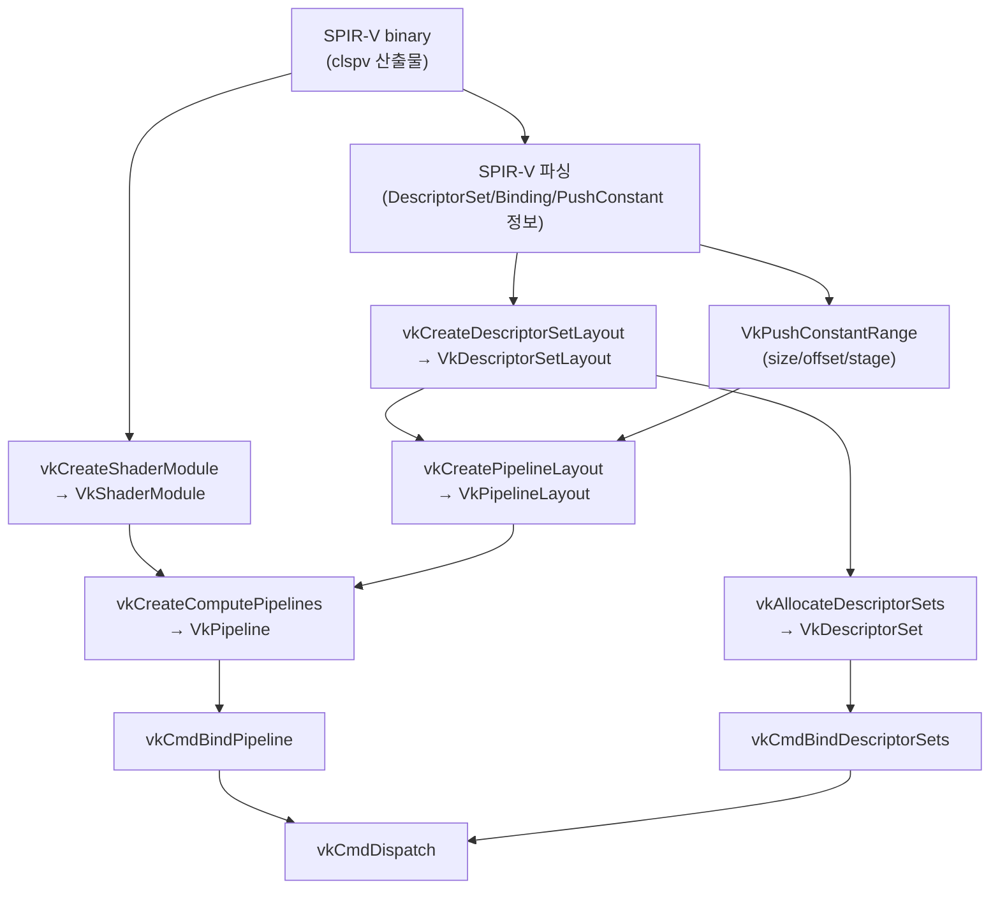

1차 추적에서 compile/submit chain 지도를 만들었다.  
2차에서는 그 지도에서 **SPIR-V가 실제 Vulkan 객체로 이어지는 지점**을 찾는다.

---

## 핵심 질문 4개

이 4개에 답이 잡히면 "SPIR-V → Vulkan dispatch"가 연결된다.

1. SPIR-V 모듈은 어디서 로드/보관되는가?
2. DescriptorSet/Binding 정보는 어디서 `VkDescriptorSetLayout`으로 반영되는가?
3. PushConstant 정보는 어디서 `VkPipelineLayout` range로 반영되는가?
4. 최종적으로 어느 지점에서 compute pipeline 객체가 확정되는가?

---

## 논리적 연결 프레임

실제 코드 구조는 구현체마다 다르지만, 객체 의존 관계는 이 프레임을 크게 벗어나지 않는다.



---

## 추적 키워드 목록

ANGLE 소스에서 아래 키워드를 중심으로 찾는다.

| 찾을 것 | 검색 키워드 |
|--------|------------|
| SPIR-V 처리 | `spirv`, `SPIRV`, `shaderModule`, `createShaderModule` |
| Descriptor Layout | `DescriptorSetLayout`, `descriptorSetLayout` |
| Pipeline Layout | `PipelineLayout`, `pipelineLayout`, `PushConstant` |
| Pipeline 생성 | `ComputePipeline`, `vkCreateComputePipelines` |
| Dispatch | `vkCmdBindPipeline`, `vkCmdBindDescriptorSets`, `vkCmdDispatch` |

> 팁: 한 번에 완벽히 찾으려 하지 말고, "이 함수가 어떤 Vulkan 객체를 만드는가" 라벨링부터 한다.

---

## 추적 기록 템플릿

각 항목을 채워가면 2차 추적이 완성된다.

### [A] SPIR-V → ShaderModule
```
후보 함수:
입력 데이터:
출력 Vulkan 객체: VkShaderModule
확인 근거 (파일/라인):
```

### [B] Binding 정보 → DescriptorSetLayout
```
후보 함수:
set/binding 반영 방식:
생성되는 layout 객체: VkDescriptorSetLayout
근거:
```

### [C] PushConstant → PipelineLayout
```
후보 함수:
range (size/offset/stage) 반영 방식:
근거:
```

### [D] Pipeline 생성
```
후보 함수:
vkCreateComputePipelines 연결 여부:
pipeline cache/재사용 힌트:
근거:
```

### [E] Dispatch 체인
```
bind pipeline 함수:
bind descriptor sets 함수:
dispatch 함수:
근거:
```

---

## 자주 생기는 혼동

**혼동 1**: "SPIR-V가 있으면 바로 dispatch 가능"  
→ 아님. descriptor set layout / pipeline layout / compute pipeline 생성/검증이 필요하다.

**혼동 2**: "binding 정보는 런타임에 즉흥 처리"  
→ Vulkan은 명시적 계약(layout) 기반이라 즉흥 처리 폭이 극히 작다.

**혼동 3**: "enqueue 지연 = 컴파일"  
→ pipeline 생성/캐시 미스/초기 submit 비용일 수 있다.

---

## 이해 확인 질문

### Q1. SPIR-V 다음에 바로 dispatch가 아니라 layout/pipeline 단계가 필요한 이유는?

<details>
<summary>정답 보기</summary>

Vulkan은 명시적 계약 모델이다.  
리소스 바인딩 규격(DescriptorSetLayout)과 전체 입력 계약(PipelineLayout), 실행 객체(ComputePipeline)가  
선행되어야 드라이버가 안전하고 빠르게 dispatch할 수 있다.

</details>

### Q2. 키워드 기반 라벨링을 먼저 하는 이유는?

<details>
<summary>정답 보기</summary>

함수 내부 디테일을 파기 전에 **객체 생성 책임**을 먼저 분류해야 전체 지형을 잃지 않는다.  
"이 함수는 ShaderModule 담당", "이 함수는 PipelineLayout 담당" 식으로 라벨링하면 추적 경로가 정리된다.

</details>

### Q3. PushConstant 추적에서 반드시 확인할 항목은?

<details>
<summary>정답 보기</summary>

`VkPushConstantRange`의 `size`, `offset`, `stageFlags` 세 필드.  
그리고 이 range가 `vkCreatePipelineLayout` 호출 시 포함되는지 확인.

</details>

### Q4. `vkCreateComputePipelines`를 찾았다고 끝이 아닌 이유는?

<details>
<summary>정답 보기</summary>

Pipeline 생성은 중간 단계다.  
실제 실행에는 `vkCmdBindPipeline` + `vkCmdBindDescriptorSets` + (push constants) + `vkCmdDispatch`  
전체 연결 확인이 필요하다.

</details>

### Q5. 이번 노트의 완료 기준은?

<details>
<summary>정답 보기</summary>

SPIR-V → ShaderModule → DescriptorSetLayout → PipelineLayout → ComputePipeline → Dispatch로  
이어지는 함수 후보 맵(근거 포함) 1차 작성 완료.

</details>

---

## 관련 글

- [ANGLE 추적 1차](/opencl-note-angle-phase1/) — 지도 만들기 1차
- [SPIR-V↔Vulkan 매핑](/opencl-note-spirv-vulkan-mapping/) — 이론적 매핑 참조
- [ANGLE 심화 킥오프](/opencl-note-angle-kickoff/) — 실제 함수 체인 표 완성

## 관련 용어

[[ANGLE]], [[SPIR-V]], [[descriptor-set]], [[pipeline-layout]], [[command-buffer]]
