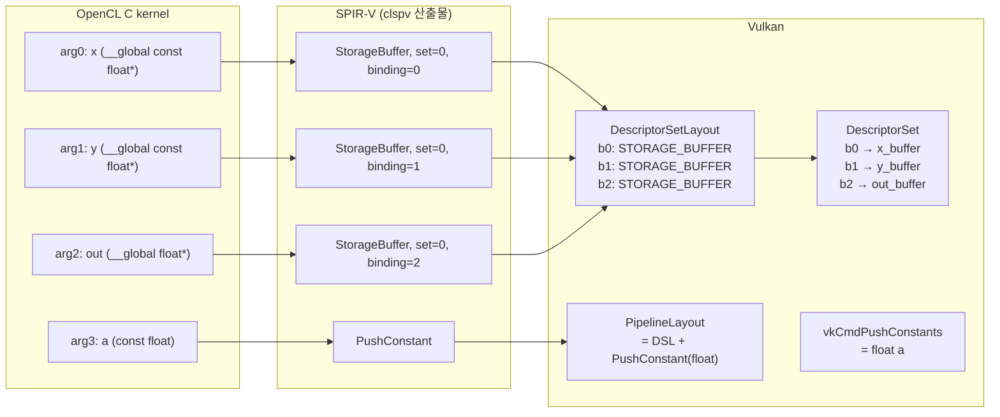

"OpenCL 인자가 어떻게 Vulkan 슬롯이 되는가"를 saxpy 커널 하나로 구체화한다.

---

## 예제 커널: saxpy

```c
__kernel void saxpy(
    __global const float* x,   // arg0
    __global const float* y,   // arg1
    __global float* out,       // arg2
    const float a              // arg3
) {
    int i = get_global_id(0);
    out[i] = a * x[i] + y[i];
}
```

---



## 인자 → 슬롯 매핑 과정



---

## 실제 Vulkan 코드 흐름

```c
// 1. DSL 생성 (arg0~2 → binding 0~2)
VkDescriptorSetLayoutBinding bindings[] = {
    { .binding=0, .descriptorType=VK_DESCRIPTOR_TYPE_STORAGE_BUFFER, ... },
    { .binding=1, .descriptorType=VK_DESCRIPTOR_TYPE_STORAGE_BUFFER, ... },
    { .binding=2, .descriptorType=VK_DESCRIPTOR_TYPE_STORAGE_BUFFER, ... },
};

// 2. PipelineLayout 생성 (DSL + push constant)
VkPushConstantRange pcRange = { .size=sizeof(float), ... };
// vkCreatePipelineLayout(... dslArray + pcRange ...)

// 3. Descriptor Set에 실제 버퍼 연결
// vkUpdateDescriptorSets: b0←x, b1←y, b2←out

// 4. Dispatch 전 bind
vkCmdBindPipeline(cmdBuf, VK_PIPELINE_BIND_POINT_COMPUTE, pipeline);
vkCmdBindDescriptorSets(cmdBuf, ..., descriptorSet, ...);
vkCmdPushConstants(cmdBuf, ..., sizeof(float), &a);
vkCmdDispatch(cmdBuf, n/64, 1, 1);
```

---

## arg3 (스칼라 `a`)가 PushConstant인 이유

- `__global` 포인터가 아닌 **작은 스칼라 값**
- descriptor slot을 쓰지 않아도 된다
- command buffer에 직접 기록 → 오버헤드 최소
- clspv가 이 패턴을 자동으로 PushConstant로 매핑한다

---

## 실전 체크포인트

- 커널 시그니처를 바꾸면 → descriptor layout/write 코드도 함께 재검토
- SPIR-V의 reflection 정보(set/binding/type)를 기준으로 host 코드와 대조
- pipeline create 성공만으로 안심하지 말고 bind/dispatch 호환성까지 확인

---

## 이해 확인 질문

### Q1. saxpy에서 arg0~2가 binding 0~2로 매핑되는 이유는?

<details>
<summary>정답 보기</summary>

clspv가 `__global` 포인터 인자를 순서대로 StorageBuffer descriptor binding으로 매핑한다.  
(실제 binding 번호는 clspv 옵션/반사 정책에 따라 달라질 수 있으나, 기본 동작은 순서 기반)

</details>

### Q2. `const float a`가 PushConstant로 내려가는 이유는?

<details>
<summary>정답 보기</summary>

`__global` 포인터가 아닌 작은 스칼라 값이라 별도 descriptor slot이 낭비된다.  
PushConstant는 command buffer에 직접 기록되어 오버헤드가 작다.  
clspv가 이 패턴을 자동으로 PushConstant로 매핑한다.

</details>

### Q3. 커널 시그니처를 바꾸면 무엇을 함께 바꿔야 하는가?

<details>
<summary>정답 보기</summary>

1. `VkDescriptorSetLayoutBinding` 배열 재생성
2. `VkPipelineLayout` 재생성
3. `vkUpdateDescriptorSets` 코드 재검토
4. push constant range 및 크기/offset 확인

</details>

---

## 관련 글

- [clspv 실전](/opencl-note-clspv-practice/) — vector_add 대응표
- [SPIR-V↔Vulkan 매핑](/opencl-note-spirv-vulkan-mapping/) — 매핑 이론
- [고정 슬롯이 빠른 이유](/opencl-note-fixed-slots-fast/) — 슬롯 계약의 성능 원리

## 관련 용어

[[descriptor-set]], [[pipeline-layout]], [[SPIR-V]], [[clspv]]
