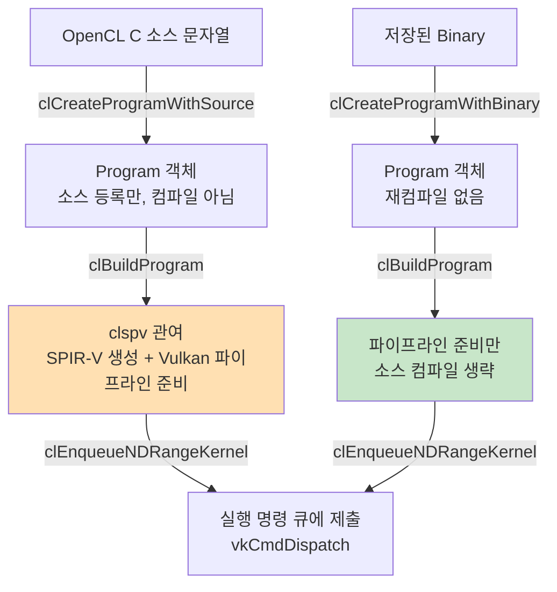

"처음 실행할 때 왜 느리지?" — 이 현상의 원인은 여러 단계가 섞여 있다.  
이 노트는 **소스 등록 / 컴파일 / 캐시 / 제출**을 명확히 분리한다.

---

## 4가지 경계 한눈에



---

## 1) clCreateProgramWithSource — "소스 등록" 단계

소스 코드를 Program 객체에 연결하는 단계. **컴파일이 완료된 상태가 아니다.**

```c
cl_program program = clCreateProgramWithSource(
    context, 1, &source, NULL, &err
);
// 이 시점: 소스가 Program 안에 저장됨. GPU는 아직 모름.
```

---

## 2) clBuildProgram — "실행 가능한 형태로 준비" 단계

이 단계에서 실제 컴파일 작업이 일어난다.

ANGLE + clspv 프레임에서:

```
clBuildProgram() 호출
    ↓
OpenCL C → clspv → SPIR-V 생성
    ↓
SPIR-V → Vulkan Compute Pipeline 생성 준비
```

> 구현에 따라 일부 pipeline 생성은 lazy(첫 enqueue 시)될 수 있다.

---

## 3) Binary Path — clCreateProgramWithBinary

이미 저장된 binary가 있다면 소스 재컴파일을 건너뛴다.

| 경로 | 장점 | 단점 |
|------|------|------|
| Source path | 개발 편의, 이식성 | 초기 build 비용 발생 |
| Binary path | 재컴파일 없음, 빠른 초기화 | 벤더/드라이버/옵션 변경 시 재사용 불가 |

---

## 4) 캐시가 개입하는 3지점

"첫 실행이 느린" 현상은 아래 3가지가 합쳐진 것일 수 있다.

```
1. OpenCL 소스 → SPIR-V 변환 캐시 (clspv 컴파일 결과)
2. Vulkan pipeline 생성 결과 캐시 (PipelineCache)
3. 드라이버 내부 JIT/ISA 변환 캐시 (GPU별 기계어)
```

따라서 "enqueue가 느리다"고 단정하지 말고, 어느 캐시가 cold한지 분리해서 봐야 한다.

---

## 코드 추적 체크포인트 (ANGLE 분석 시)

앞으로 ANGLE 코드를 추적할 때 이 3가지 경로를 반드시 분리해서 본다:

1. **생성 경로**: `clCreateProgramWithSource` / `clCreateProgramWithBinary` 호출 지점
2. **build 경로**: `clBuildProgram` → clspv → SPIR-V → Vulkan pipeline 준비 지점
3. **enqueue 경로**: `clEnqueueNDRangeKernel` → vkCmdDispatch → queue submit 지점

이 3개가 섞이면 이해가 급격히 어려워진다.

---

## 이해 확인 질문

### Q1. clCreateProgramWithSource와 clBuildProgram의 책임 차이는?

<details>
<summary>정답 보기</summary>

- `clCreateProgramWithSource`: 소스 코드를 Program 객체에 **등록**하는 단계. 컴파일 없음.
- `clBuildProgram`: 소스를 **실행 가능한 형태로 컴파일**하는 단계. clspv → SPIR-V → pipeline 준비.

</details>

### Q2. binary path가 초기 실행 성능에 유리한 이유는?

<details>
<summary>정답 보기</summary>

이미 컴파일된 binary를 로드하므로 `clBuildProgram`에서 clspv 컴파일 비용이 발생하지 않는다.  
재실행/재시작 시 같은 binary를 재사용하면 초기 지연을 크게 줄일 수 있다.

</details>

### Q3. enqueue 시점 지연이 항상 "컴파일 때문"이라고 단정하면 왜 위험한가?

<details>
<summary>정답 보기</summary>

지연은 compile 비용, pipeline 생성 비용, 드라이버 JIT 비용이 **합쳐진** 결과일 수 있다.  
어느 단계가 cold인지 모르고 "컴파일 때문"으로 단정하면 잘못된 최적화 방향으로 빠질 수 있다.

</details>

### Q4. clspv는 어느 단계에 관여하는가?

<details>
<summary>정답 보기</summary>

`clBuildProgram` 단계에서 OpenCL C → SPIR-V 변환에 관여한다.  
구현에 따라 일부는 lazy(첫 enqueue 시)될 수 있지만, 개념 모델상 build 단계에 배치한다.

</details>

### Q5. ANGLE 코드 추적에서 반드시 분리해야 할 3개 경로는?

<details>
<summary>정답 보기</summary>

1. **소스/바이너리 Program 생성** 경로
2. **build 호출 시 컴파일/변환** 경로 (clspv → SPIR-V → pipeline)
3. **enqueue 시 Vulkan command recording/submit** 경로

</details>

---

## 관련 글

- [객체 라이프사이클](/opencl-note-lifecycle/) — API 호출 순서와 실제 작업 시점 전체 그림
- [SPIR-V 최소 읽기법](/opencl-note-spirv-reading/) — clBuildProgram 결과물인 SPIR-V 관찰 방법
- [first-run 지연 줄이기](/opencl-note-first-run-latency/) — 캐시 전략과 warm-up 실전

## 관련 용어

[[SPIR-V]], [[clspv]], [[command-queue]], [[pipeline-layout]]
