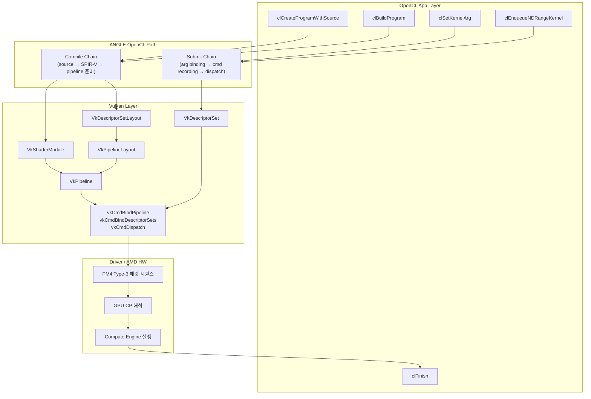

기초~중급을 모두 마쳤다면 이 한 장으로 전체 그림이 머릿속에 있어야 한다.  
각 칸을 말로 설명할 수 있으면 다음 단계(심화 추적)로 갈 준비가 된 것이다.

---

## 전체 경로 한 장

---

## 두 체인 요약

| | Compile Chain | Submit Chain |
|--|--------------|-------------|
| 진입 | `clCreateProgramWithSource` / `clBuildProgram` | `clSetKernelArg` / `clEnqueueNDRangeKernel` |
| 변환 | OpenCL C → clspv → SPIR-V → VkPipeline | Arg → VkDescriptorSet → Command Recording |
| 산출물 | VkShaderModule, VkPipelineLayout, VkPipeline | VkCommandBuffer (기록 완료) |
| 느리면 | clspv 컴파일 / pipeline 생성 | recording overhead / submit latency |

---

## 완료 체크리스트

Phase 1~2를 끝낸 뒤 아래를 직접 확인한다.

### A. 개념/용어
- [ ] Pipeline / Pipeline Layout 차이를 설명할 수 있다
- [ ] Descriptor Set / Descriptor Set Layout 차이를 설명할 수 있다
- [ ] Layout(계약)이 왜 필요한지 설명할 수 있다

### B. 체인 분리
- [ ] compile chain vs submit chain을 구분해 말할 수 있다
- [ ] enqueue 지연 원인을 단일 원인으로 단정하지 않는다

### C. clspv/SPIR-V
- [ ] OpenCL C → clspv → SPIR-V 흐름을 설명할 수 있다
- [ ] SPIR-V에서 최소 관찰 포인트 5개를 찾을 수 있다
- [ ] vector_add 인자 ↔ binding 대응표를 만들 수 있다

### D. Vulkan 연결
- [ ] set/binding이 descriptor set layout으로 이어짐을 설명할 수 있다
- [ ] push constant가 pipeline layout range로 이어짐을 설명할 수 있다
- [ ] dispatch 전 bind 순서를 설명할 수 있다

### E. PM4
- [ ] PM4가 하드웨어 근접 명령 스트림임을 설명할 수 있다
- [ ] Type-3가 왜 우선 추적 대상인지 설명할 수 있다
- [ ] dispatch를 패킷 "시퀀스" 관점으로 이해한다

---

## 이해 확인 질문

### Q1. 전체 경로를 6단계 이내로 요약해봐.

정답 보기

1. OpenCL API (clEnqueueNDRangeKernel 등)
2. ANGLE (compile chain / submit chain 분리)
3. clspv → SPIR-V → Vulkan layout/pipeline
4. vkCmdBindPipeline + vkCmdBindDescriptorSets + vkCmdDispatch
5. 드라이버 → PM4 Type-3 패킷 시퀀스
6. GPU CP 해석 → Compute Engine 실행

### Q2. Pipeline과 Descriptor Set의 역할 차이를 한 줄씩 써봐.

정답 보기

- **Pipeline**: 계산 로직/실행 상태 (어떤 셰이더로 어떻게 실행할지)
- **Descriptor Set**: 계산에 투입할 실제 리소스 묶음 (어떤 버퍼를 쓸지)

### Q3. compile chain과 submit chain을 분리해야 하는 이유는?

정답 보기

오류/지연의 원인을 정확히 분리해 **디버깅/최적화를 올바른 방향으로** 하기 위해서다.  
섞으면 "느린 이유가 컴파일인지 dispatch인지" 알 수 없다.

### Q4. PM4에서 지금 단계 우선 포인트는?

정답 보기

Type-3 중심 패킷 시퀀스 관점으로 dispatch 주변 흐름을 보는 것.  
개별 패킷 비트필드 암기보다 **설정 패킷 → dispatch 트리거** 순서 이해가 우선.

### Q5. 다음 심화 사이클에서 먼저 하고 싶은 것을 하나 고르면?

정답 보기

열린 답 — 아래 중 자신에게 가장 불명확한 것을 선택:
- ANGLE 실제 함수 체인 표 작성 (파일/라인 근거)
- clspv 커널 추가 실습 (local memory, barrier 포함)
- Vulkan 객체 생성 코드 근거 수집
- AMD PM4 문서와 대조해 dispatch 패킷 패밀리 해석

---

## 관련 글

- [심화 로드맵](/opencl-deep-dive-roadmap/) — 단계별 산출물 목록
- [오답노트 #01](/opencl-wrong-note-barrier-scope/) — 이 과정에서 자주 틀리는 개념들
- [퀴즈 문제 창고](/opencl-quiz-bank-01/) — 체크리스트 확인용 문제

## 관련 용어

[[ANGLE]], [[SPIR-V]], [[clspv]], [[pm4-packet]], [[pipeline-layout]], [[descriptor-set]]
