"왜 layout이 필요할까? pipeline 10개, descriptor set 3개라면 정말 호환 제약이 생길까?"  
답은 **그렇다**. 그리고 그 제약이 성능/검증/예측 가능성을 만든다.

---

## 한 줄 요약

- Pipeline = 연산 로직 (무엇을 계산할지)
- Descriptor Set = 실제 리소스 묶음 (어떤 데이터를 쓸지)
- Layout = 둘이 맞물리는 계약서 (아무 set이나 아무 pipeline에 꽂을 수 없다)

---

## Animation: 호환/비호환 시나리오



---

## 호환/비호환 다이어그램

```mermaid
flowchart LR
    subgraph contract["Pipeline Layout Contract (계약서)"]
        C0["set0: b0 storage, b1 storage, b2 storage"]
        C1["push constant: int n (4 bytes)"]
    end

    subgraph pipelines["Pipelines"]
        P1["Pipeline A"]
        P2["Pipeline B"]
    end

    subgraph sets["Descriptor Sets"]
        S1["Set X\nb0 storage ✓\nb1 storage ✓\nb2 storage ✓"]
        S2["Set Y\nb0 uniform ✗\nb1 storage\nb2 storage"]
        S3["Set Z\nb0 storage ✓\nb1 storage ✓\n(b2 없음) ✗"]
    end

    contract --> P1
    contract --> P2

    S1 -->|"호환 ✓"| P1
    S1 -->|"호환 ✓"| P2
    S2 -->|"비호환: b0 타입 불일치"| P1
    S3 -->|"비호환: b2 슬롯 누락"| P2
```

핵심:
- Set X만 계약과 일치하여 bind 가능
- Set Y/Z는 타입/개수 불일치로 호환 불가

---

## 왜 이런 제약을 일부러 두나?

### A. 검증 앞당기기
런타임 직전이 아니라 **더 이른 단계**에서 "이 조합 가능/불가"를 판단.  
디버깅이 쉬워지고 오류가 늦게 터지지 않는다.

### B. 성능 최적화
드라이버가 "어떤 형식의 리소스가 들어올지"를 미리 알고  
**주소 계산 / 슬롯 접근 경로**를 최적화할 수 있다.

### C. 명령 스트림 정형화
GPU에 전달되는 PM4 패킷 구성이 더 규칙적이 된다.  
하드웨어는 규칙적/예측 가능한 접근에서 효율이 높다.

---

## 역사 관점

과거 OpenGL 스타일 드라이버는 암묵적 상태를 많이 추론해야 했다.  
그만큼 성능 예측과 디버깅이 어려웠다.

Vulkan은 반대로 **계약(Layout) 중심**으로 바꿨다.  
애플리케이션이 명시적으로 규격을 선언하는 대신, 실행/검증/최적화가 훨씬 예측 가능해졌다.

---

## 이해 확인 질문

### Q1. Pipeline과 Descriptor Set이 각각 담당하는 것은?

정답 보기

- **Pipeline**: 계산 로직/실행 상태 (무엇을 계산할지)
- **Descriptor Set**: 실제 리소스 묶음 (어떤 버퍼/이미지로 계산할지)

### Q2. Layout 계약이 없으면 어떤 문제가 생기나?

정답 보기

호환성 검증이 늦어지고, 드라이버 최적화 여지가 줄며, 디버깅이 어려워진다.  
"어떤 타입이 들어올지" 모르면 드라이버가 런타임마다 추론해야 한다.

### Q3. Set Y가 비호환인 직접 이유는?

정답 보기

계약은 `b0`이 `StorageBuffer` 타입인데, Set Y는 `b0`을 `UniformBuffer`로 제공했다.  
타입 불일치 — descriptor type이 계약과 다르다.

### Q4. 고정 슬롯 계약이 성능에 유리한 이유를 3가지로 설명하면?

정답 보기

1. **주소 계산 단순화**: 슬롯 인덱스로 descriptor table 접근 경로가 예측 가능
2. **검증 비용 앞당김**: 타입/개수 검사를 create/bind 단계에 집중
3. **명령 스트림 정형화**: 드라이버가 더 규칙적인 PM4 패킷을 구성 가능

### Q5. Vulkan이 layout 명시성을 요구하는 대신 얻는 것은?

정답 보기

- 실행/검증의 **예측 가능성**
- 드라이버 **최적화 여지** 증가
- **오류 조기 발견** — 불일치가 dispatch 시점이 아니라 bind/validation 시점에 드러남

---

## 관련 글

- [Vulkan 용어 직관](/opencl-note-vulkan-terms-intuition/) — descriptor/pipeline/layout 비유
- [SPIR-V↔Vulkan 매핑](/opencl-note-spirv-vulkan-mapping/) — 계약서가 만들어지는 과정
- [고정 슬롯이 빠른 이유](/opencl-note-fixed-slots-fast/) — 성능 원리 심화

## 관련 용어

[[descriptor-set]], [[pipeline-layout]], [[SPIR-V]], [[ANGLE]]
