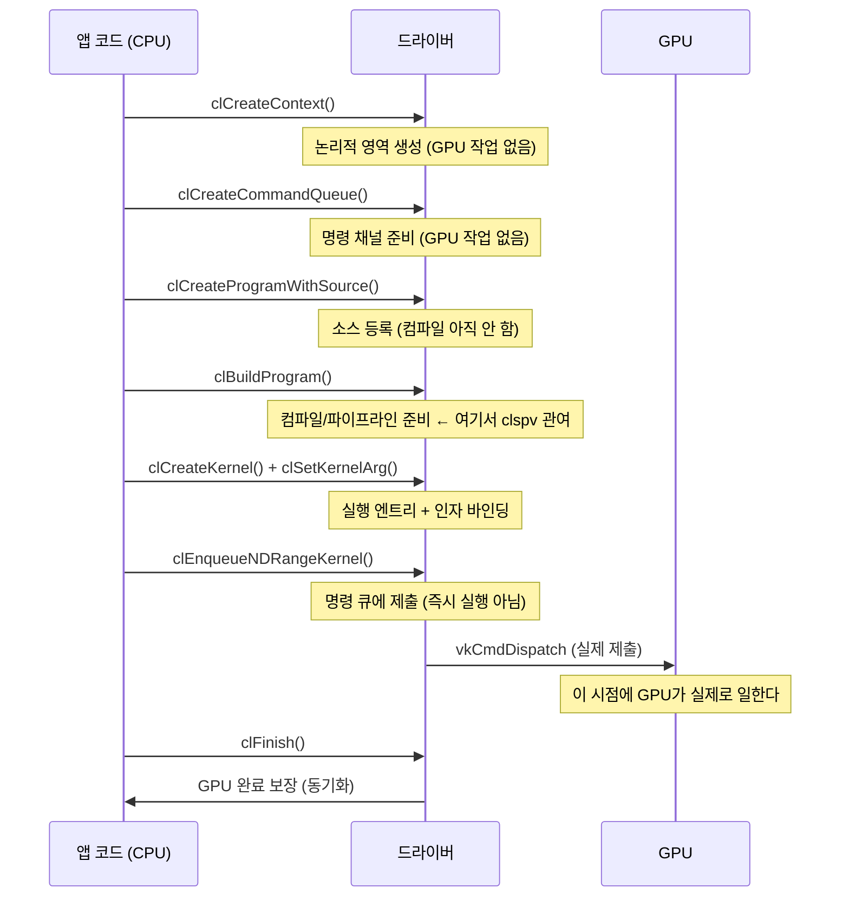

OpenCL 코드를 처음 읽으면 API 호출 순서가 곧 실행 순서처럼 보인다.  
그런데 실제로는 **"API를 부른 시점"**과 **"GPU가 실제로 일한 시점"**이 다르다.  
이 차이를 이해하는 것이 이 시리즈 전체의 출발점이다.

---

## API 호출 순서 vs 실제 작업 시점



---

## 객체별 책임

| 객체 | 책임 |
|------|------|
| **Platform/Device** | 어떤 구현/하드웨어를 쓸지 선택 |
| **Context** | 리소스/객체가 공유되는 논리적 영역 |
| **Command Queue** | 실행 명령이 들어가는 순서/동기화 단위 |
| **Program** | 커널 코드의 컴파일 대상 단위 |
| **Kernel** | 실행 엔트리(함수) + argument 바인딩 대상 |

---

## 핵심 오해 3가지

**오해 1**: `clEnqueueNDRangeKernel`을 부르면 그때 컴파일된다?  
→ 아니다. 컴파일은 `clBuildProgram` 단계에서 일어난다. Enqueue는 실행 제출이다.

**오해 2**: `clFinish`가 결과를 받아오는 API다?  
→ 아니다. `clFinish`는 "큐에 제출된 모든 명령이 완료될 때까지 CPU가 기다리는" 동기화 API다.

**오해 3**: build하면 바로 GPU가 실행된다?  
→ 아니다. build는 실행 준비(컴파일/파이프라인 생성)이고, 실제 GPU 실행은 enqueue → queue submit 이후다.

---

## compile chain vs submit chain

이후 노트에서 계속 나오는 핵심 구분:

| compile chain | submit chain |
|---------------|-------------|
| 코드 변환/준비 경로 | 실행 명령 기록/제출 경로 |
| clCreateProgram → clBuildProgram | clEnqueueNDRangeKernel → clFinish |
| clspv → SPIR-V → 파이프라인 생성 | vkCmdDispatch → queue submit |

---

## 이해 확인 질문

### Q1. `clEnqueueNDRangeKernel`이 항상 컴파일을 의미하지 않는 이유는?

정답 보기

컴파일은 `clBuildProgram` 단계에서 이미 완료된다.  
이미 build된 program이면 enqueue는 **실행 제출 단계**이며, 다시 컴파일하지 않는다.  
캐시 hit이면 build 비용도 매우 작거나 거의 없다.

### Q2. Program과 Kernel의 책임 차이는?

정답 보기

- **Program**: 커널 코드 전체의 컴파일 대상 단위. 여러 커널 함수를 포함할 수 있다.
- **Kernel**: 그 Program 안에서 실행 시작점이 되는 특정 함수 + argument 바인딩 상태.

Program은 "파일", Kernel은 "실행 가능한 특정 함수"에 비유할 수 있다.

### Q3. `clFinish`를 동기화 관점에서 설명하면?

정답 보기

큐에 제출된 모든 명령이 GPU에서 완료될 때까지 CPU 스레드를 블로킹한다.  
내부적으로는 VkFence를 생성하고 `vkWaitForFences`로 GPU 완료를 기다린다.  
결과를 "받아오는" API가 아니라 "완료를 보장하는" 동기화 API다.

### Q4. build 단계와 dispatch 단계를 분리하면 어떤 이점이 있나?

정답 보기

- **재사용 가능**: 한 번 build한 pipeline을 여러 번 dispatch에 재사용할 수 있다.
- **성능 분리**: 느린 컴파일 비용과 빠른 dispatch 비용을 별도로 측정/최적화할 수 있다.
- **캐시 전략**: 미리 build해두거나 binary를 저장해두면 초기 지연을 줄일 수 있다.

### Q5. 다음으로 descriptor set을 공부해야 하는 이유는?

정답 보기

`clSetKernelArg`로 설정한 인자들이 Vulkan 쪽에서는 descriptor set binding으로 표현된다.  
이 매핑을 이해해야 SPIR-V의 OpDecorate, Vulkan의 pipeline layout/descriptor set이  
"OpenCL 커널 인자를 어떻게 받는지" 전체 그림이 연결된다.

---

## 관련 글

- [Build/캐시 경계](/opencl-note-build-cache/) — clBuildProgram 안에서 무슨 일이 일어나는가
- [clFinish 내부](/clfinish-internals/) — Fence, Semaphore, IT_EVENT_WRITE 연결
- [PM4 제출 흐름](/pm4-submit-flow-animation/) — GPU가 실제로 일하는 시점의 내부

## 관련 용어

[[command-queue]], [[work-item]], [[NDRange]], [[SPIR-V]]
