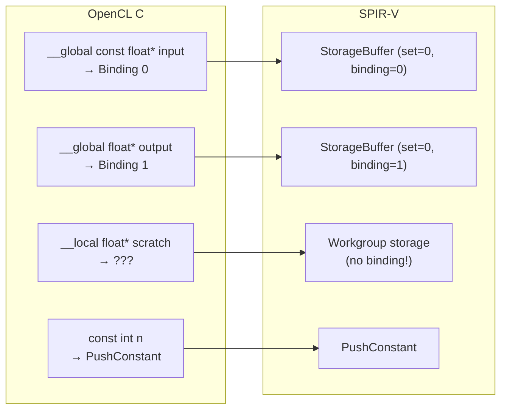

`vector_add`는 독립 연산이었다. 이제 **workgroup 내 협력 연산**을 다룬다.  
`__local` 메모리와 `barrier()`가 SPIR-V에서 어떻게 표현되는지 관찰한다.

---

## 두 가지 핵심 변화

| vector_add | local memory 커널 |
|-----------|-----------------|
| work-item들이 서로 독립 | workgroup 내 work-item들이 공유 메모리 접근 |
| barrier 불필요 | barrier로 접근 순서 보장 필수 |
| global buffer만 | `__local` 추가 |

---

## 실습 커널: local_sum

```c
__kernel void local_sum(
    __global const float* input,
    __global float* output,
    __local float* scratch,       // local memory
    const int n)
{
    int lid = get_local_id(0);
    int gid = get_global_id(0);

    // 1. global → local 복사
    scratch[lid] = (gid < n) ? input[gid] : 0.0f;

    // 2. 모든 work-item이 복사 완료될 때까지 대기
    barrier(CLK_LOCAL_MEM_FENCE);

    // 3. local 메모리로 reduction
    for (int s = get_local_size(0) / 2; s > 0; s >>= 1) {
        if (lid < s) {
            scratch[lid] += scratch[lid + s];
        }
        barrier(CLK_LOCAL_MEM_FENCE);
    }

    // 4. 결과 저장
    if (lid == 0) output[get_group_id(0)] = scratch[0];
}
```

---

## SPIR-V에서 무엇이 달라지는가

### `__local` → Workgroup Storage Class



`__local`은 **descriptor binding이 없다** — workgroup 내 공유 메모리로 GPU가 직접 관리한다.

### `barrier()` → OpControlBarrier

```
// OpenCL C
barrier(CLK_LOCAL_MEM_FENCE);

// SPIR-V
OpControlBarrier %uint_2 %uint_2 %uint_264
               ^^^       ^^^       ^^^
            Workgroup  Workgroup  AcquireRelease | WorkgroupMemory
            (scope)    (scope)    (semantics)
```

`OpControlBarrier` 파라미터:
- 첫 번째: **execution scope** — 어느 범위가 barrier에 참여하는가 (Workgroup=2)
- 두 번째: **memory scope** — 어느 범위의 메모리를 동기화하는가 (Workgroup=2)
- 세 번째: **semantics** — 메모리 순서 보장 방식 (AcquireRelease | WorkgroupMemory)

---

## 관찰 체크리스트

```bash
spirv-dis local_sum.spv -o local_sum.spvasm
```

찾아볼 것:
- [ ] `%_ptr_Workgroup` — `__local` 변수의 storage class
- [ ] `OpVariable ... Workgroup` — local 배열 선언
- [ ] `OpControlBarrier` — barrier 위치와 파라미터
- [ ] barrier 전/후 `OpLoad`/`OpStore` 패턴 — 접근 순서 변화

---

## 핵심 3줄

1. `__local` = workgroup 공유 메모리 → SPIR-V에서 `Workgroup` storage class, **binding 없음**
2. `barrier()` = 접근 순서/가시성 보장 → SPIR-V에서 `OpControlBarrier`
3. barrier 전/후로 읽기/쓰기 패턴을 함께 봐야 올바른 동기화 이해 가능

---

## 자주 하는 오해

**오해**: `__local`도 그냥 global buffer처럼 descriptor set에 binding된다  
→ 아니다. Workgroup 메모리는 GPU가 직접 관리하는 공간이라 binding 번호가 없다.

**오해**: `barrier`는 성능 옵션이다  
→ 아니다. `barrier` 없이 공유 메모리를 읽으면 **데이터 경합(race condition)**이 발생한다. 정확성의 문제다.

---

## 이해 확인 질문

### Q1. `__local`이 global buffer와 다르게 다뤄지는 이유는?

<details>
<summary>정답 보기</summary>

`__local`은 workgroup 내 공유 메모리 성격이다.  
- GPU가 직접 관리하는 on-chip 메모리 (LDS)
- descriptor binding 번호가 없다
- 접근 scope와 동기화 규칙이 global buffer와 다르다

</details>

### Q2. `OpControlBarrier`의 파라미터 3개는 각각 무엇인가?

<details>
<summary>정답 보기</summary>

1. **Execution Scope**: barrier에 참여하는 실행 범위 (Workgroup=2)
2. **Memory Scope**: 동기화할 메모리 범위 (Workgroup=2)
3. **Memory Semantics**: 메모리 순서 보장 방식 (AcquireRelease | WorkgroupMemory)

</details>

### Q3. barrier 없이 shared memory 패턴을 쓰면 어떤 문제가 생기나?

<details>
<summary>정답 보기</summary>

데이터 경합(race condition)이 발생한다.  
일부 work-item은 아직 복사가 완료되지 않은 메모리를 읽게 되어 결과가 불확정적이 된다.  
barrier는 성능 옵션이 아니라 **정확성을 보장하는 동기화 지점**이다.

</details>

### Q4. SPIR-V에서 `__local` 배열을 인식하는 키워드는?

<details>
<summary>정답 보기</summary>

`OpVariable`의 Storage Class가 `Workgroup`인 선언.  
예: `%scratch = OpVariable %ptr_Workgroup_arr Workgroup`

</details>

---

## 관련 글

- [SPIR-V 최소 읽기법](/opencl-note-spirv-reading/) — 기본 관찰 포인트
- [clspv 실전](/opencl-note-clspv-practice/) — vector_add 대응표 기초
- [vkCmdPipelineBarrier](/vulkan-pipeline-barrier/) — Vulkan 레벨의 barrier와 비교

## 관련 용어

[[local-memory]], [[barrier]], [[SPIR-V]], [[wavefront]], [[work-group]]
