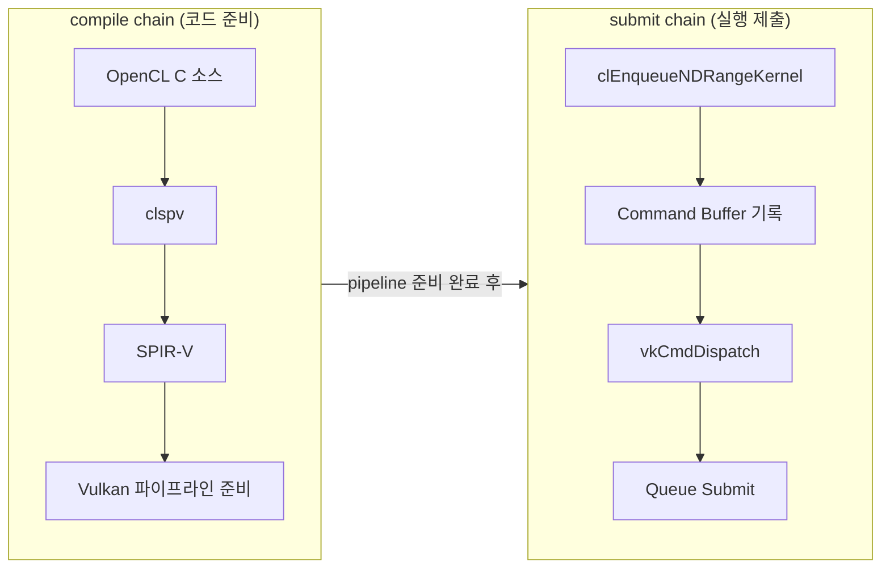

SPIR-V를 "완전히 이해"하려고 하면 막힌다.  
지금 단계에서 필요한 건 **ANGLE 추적에 필요한 최소 5개 관찰 포인트**를 잡는 것이다.

---

## compile chain vs submit chain — 왜 분리하나?

두 체인을 섞어 보면 "실행이 느리다"는 현상이 나왔을 때 원인을 분리하지 못한다.



| compile chain이 느리면 | submit chain이 느리면 |
|-----------------------|---------------------|
| clspv 컴파일 시간 | command buffer recording 오버헤드 |
| Vulkan pipeline 생성 시간 | queue submit latency |
| 캐시 cold | 동기화 대기 |

---

## SPIR-V disassembly에서 처음 볼 5개 포인트

```bash
clspv vector_add.cl -o vector_add.spv
spirv-dis vector_add.spv -o vector_add.spvasm
```

`vector_add.spvasm`에서 아래 5개만 먼저 찾는다.

### 1. OpEntryPoint
커널의 시작 함수 이름 확인
```
OpEntryPoint GLCompute %main "vector_add" ...
```

### 2. OpExecutionMode
실행 모드 — local work group size 단서
```
OpExecutionMode %main LocalSize 1 1 1
```

### 3. OpName
사람이 읽을 수 있는 이름 매핑 (디버깅 정보)
```
OpName %a_buf "a"
OpName %b_buf "b"
```

### 4. OpDecorate
descriptor binding 번호 — **Vulkan 연결의 핵심**
```
OpDecorate %a_buf DescriptorSet 0
OpDecorate %a_buf Binding 0
OpDecorate %b_buf DescriptorSet 0
OpDecorate %b_buf Binding 1
```

### 5. OpVariable + Storage Class
버퍼/인자가 어떤 메모리 공간으로 내려갔는지
```
%a_buf = OpVariable %ptr_StorageBuffer StorageBuffer
%n_pc  = OpVariable %ptr_PushConstant  PushConstant
```

---

## 관찰 포인트 요약표

| 포인트 | 알 수 있는 것 |
|--------|-------------|
| `OpEntryPoint` | 커널 함수 이름 |
| `OpExecutionMode` | local size 설정 |
| `OpName` | 변수 이름 (디버깅 편의) |
| `OpDecorate` | descriptor set/binding 번호 |
| `OpVariable` + Storage Class | 어떤 메모리 영역(StorageBuffer/PushConstant/…) |

---

## 최소 실습 루프

1. 작은 OpenCL C 커널 1개 준비 (`vector_add.cl`)
2. `clspv`로 SPIR-V 생성
3. `spirv-dis`로 disassemble
4. 위 5개 포인트 찾아 표시
5. 커널 arg ↔ SPIR-V variable/decorate **대응표 작성**

이 루프를 2~3번 반복하면, 다음 노트(Vulkan descriptor/pipeline) 이해 속도가 크게 올라간다.

---

## 이해 확인 질문

### Q1. compile chain과 submit chain을 한 줄씩 정의해봐.

<details>
<summary>정답 보기</summary>

- **compile chain**: OpenCL C 소스를 SPIR-V로 변환하고 Vulkan 실행 준비를 완료하는 경로.
- **submit chain**: 준비된 pipeline을 이용해 실행 명령을 기록하고 GPU에 제출하는 경로.

</details>

### Q2. 두 체인을 섞어 보면 어떤 문제가 생기나?

<details>
<summary>정답 보기</summary>

"실행이 느리다"는 현상이 나왔을 때 원인을 분리할 수 없다.  
compile이 느린 건지, command recording이 느린 건지, JIT이 느린 건지 구분이 안 된다.  
정확한 성능 분석과 디버깅이 어려워진다.

</details>

### Q3. SPIR-V에서 처음 볼 5개 포인트를 적어봐.

<details>
<summary>정답 보기</summary>

1. `OpEntryPoint` — 커널 시작 함수
2. `OpExecutionMode` — 실행 모드 (local size)
3. `OpName` — 이름 매핑
4. `OpDecorate` — descriptor binding 번호
5. `OpVariable` + Storage Class — 메모리 영역 분류

</details>

### Q4. 왜 SPIR-V 완전 해석보다 대응표 작성이 더 중요한가?

<details>
<summary>정답 보기</summary>

ANGLE 코드 추적의 목표는 "OpenCL 커널 인자가 Vulkan binding에 어떻게 매핑되는지"를 이해하는 것이다.  
대응표를 한 번 직접 만들면, SPIR-V를 완벽히 알지 못해도 **핵심 연결고리를 구체적으로** 파악할 수 있다.

</details>

### Q5. 다음 실습 전 최소 루프를 3단계로 줄이면?

<details>
<summary>정답 보기</summary>

1. clspv로 SPIR-V 생성
2. spirv-dis로 disassemble 후 OpDecorate/OpVariable 찾기
3. 커널 인자 ↔ DescriptorSet/Binding 대응표 작성

</details>

---

## 관련 글

- [Build/캐시 경계](/opencl-note-build-cache/) — compile chain이 build 단계와 어떻게 연결되는가
- [clspv 실전](/opencl-note-clspv-practice/) — 직접 대응표 만드는 실습
- [SPIR-V↔Vulkan 매핑](/opencl-note-spirv-vulkan-mapping/) — OpDecorate에서 Vulkan descriptor set까지

## 관련 용어

[[SPIR-V]], [[clspv]], [[descriptor-set]], [[pipeline-layout]]
