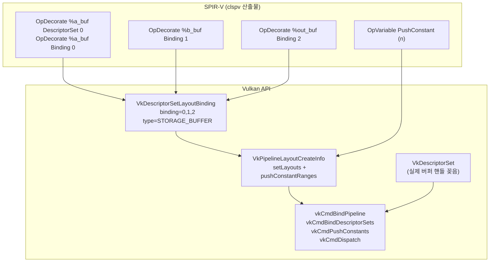

앞 노트에서 만든 대응표를 Vulkan API와 연결한다.  
SPIR-V의 `OpDecorate` 값이 Vulkan에서 **어떤 구조체의 어떤 필드**로 가는지를 1:1로 본다.

---

## 전체 매핑 그림



---

## SPIR-V → Vulkan 단계별 대응

### Step 1: OpDecorate → VkDescriptorSetLayoutBinding

```c
// SPIR-V에서 읽은 값
// DescriptorSet=0, Binding=0, type=StorageBuffer

VkDescriptorSetLayoutBinding bindings[] = {
    { .binding = 0, .descriptorType = VK_DESCRIPTOR_TYPE_STORAGE_BUFFER, ... },  // a
    { .binding = 1, .descriptorType = VK_DESCRIPTOR_TYPE_STORAGE_BUFFER, ... },  // b
    { .binding = 2, .descriptorType = VK_DESCRIPTOR_TYPE_STORAGE_BUFFER, ... },  // out
};
vkCreateDescriptorSetLayout(device, &layoutInfo, NULL, &setLayout);
```

### Step 2: PushConstant + SetLayout → VkPipelineLayout

```c
VkPushConstantRange pcRange = {
    .stageFlags = VK_SHADER_STAGE_COMPUTE_BIT,
    .offset = 0,
    .size = sizeof(int),  // n
};

VkPipelineLayoutCreateInfo pipelineLayoutInfo = {
    .setLayoutCount = 1,
    .pSetLayouts = &setLayout,
    .pushConstantRangeCount = 1,
    .pPushConstantRanges = &pcRange,
};
vkCreatePipelineLayout(device, &pipelineLayoutInfo, NULL, &pipelineLayout);
```

### Step 3: SPIR-V Module → Compute Pipeline

```c
VkShaderModuleCreateInfo smInfo = { .pCode = spvCode, .codeSize = spvSize };
vkCreateShaderModule(device, &smInfo, NULL, &shaderModule);

VkComputePipelineCreateInfo pipelineInfo = {
    .stage = { .module = shaderModule, .pName = "vector_add" },
    .layout = pipelineLayout,
};
vkCreateComputePipelines(device, NULL, 1, &pipelineInfo, NULL, &pipeline);
```

### Step 4: 실제 버퍼 → Descriptor Set

```c
// 실제 버퍼 핸들을 descriptor set에 꽂는다
VkDescriptorBufferInfo aInfo = { .buffer = a_buf, .range = VK_WHOLE_SIZE };
// ... b, out도 동일

VkWriteDescriptorSet writes[] = {
    { .dstBinding = 0, .pBufferInfo = &aInfo, ... },
    { .dstBinding = 1, .pBufferInfo = &bInfo, ... },
    { .dstBinding = 2, .pBufferInfo = &outInfo, ... },
};
vkUpdateDescriptorSets(device, 3, writes, 0, NULL);
```

### Step 5: Dispatch

```c
vkCmdBindPipeline(cmdBuf, VK_PIPELINE_BIND_POINT_COMPUTE, pipeline);
vkCmdBindDescriptorSets(cmdBuf, VK_PIPELINE_BIND_POINT_COMPUTE,
                        pipelineLayout, 0, 1, &descriptorSet, 0, NULL);
vkCmdPushConstants(cmdBuf, pipelineLayout,
                   VK_SHADER_STAGE_COMPUTE_BIT, 0, sizeof(int), &n);
vkCmdDispatch(cmdBuf, (n + 63) / 64, 1, 1);
```

---

## OpenCL 인자 → Vulkan 리소스 최종 매핑표

| OpenCL 인자 | SPIR-V | Vulkan |
|------------|--------|--------|
| `__global const float* a` | StorageBuffer, binding=0 | VkBuffer → DescriptorSet binding 0 |
| `__global const float* b` | StorageBuffer, binding=1 | VkBuffer → DescriptorSet binding 1 |
| `__global float* out` | StorageBuffer, binding=2 | VkBuffer → DescriptorSet binding 2 |
| `const int n` | PushConstant | vkCmdPushConstants |

---

## 이해 확인 질문

### Q1. DescriptorSet/Binding 데코레이션은 Vulkan의 무엇으로 대응되나?

<details>
<summary>정답 보기</summary>

`VkDescriptorSetLayoutBinding`의 `.binding` 필드로 대응된다.  
`DescriptorSet` 번호는 `vkCmdBindDescriptorSets`의 set 번호와 일치해야 한다.

</details>

### Q2. Pipeline layout이 descriptor set layout 외에 함께 들고 있어야 하는 건?

<details>
<summary>정답 보기</summary>

`VkPushConstantRange` — push constant의 stage, offset, size 정보.  
Pipeline layout은 "이 파이프라인이 어떤 descriptor set layout들과 push constant를 기대하는가"의 전체 규격서다.

</details>

### Q3. `n`이 push constant로 내려갔다면 Vulkan 쪽에서 무엇을 준비해야 하나?

<details>
<summary>정답 보기</summary>

1. `VkPipelineLayout` 생성 시 `VkPushConstantRange` 포함
2. `vkCmdPushConstants` 호출로 command buffer에 값 기록

descriptor set binding이 아니므로 `vkUpdateDescriptorSets`는 필요 없다.

</details>

### Q4. vkCmdDispatch 전에 반드시 맞아야 하는 바인딩 2가지는?

<details>
<summary>정답 보기</summary>

1. `vkCmdBindPipeline` — 어떤 셰이더/연산을 실행할지
2. `vkCmdBindDescriptorSets` — 어떤 데이터(버퍼)를 쓸지

둘 중 하나라도 빠지면 dispatch가 올바르게 동작하지 않는다.

</details>

### Q5. SPIR-V 보고 Vulkan 추적할 때 가장 먼저 맞춰볼 "대조쌍" 2개는?

<details>
<summary>정답 보기</summary>

1. `OpDecorate Binding N` ↔ `VkDescriptorSetLayoutBinding.binding = N`
2. `OpVariable PushConstant` ↔ `VkPipelineLayoutCreateInfo.pPushConstantRanges`

</details>

---

## 관련 글

- [clspv 실전](/opencl-note-clspv-practice/) — 대응표를 직접 만드는 실습
- [Vulkan 용어 직관](/opencl-note-vulkan-terms-intuition/) — descriptor/pipeline/layout을 비유로 이해
- [ANGLE 추적 2차](/opencl-note-angle-phase2/) — 실제 ANGLE 코드에서 이 연결을 추적

## 관련 용어

[[SPIR-V]], [[descriptor-set]], [[pipeline-layout]], [[clspv]]
