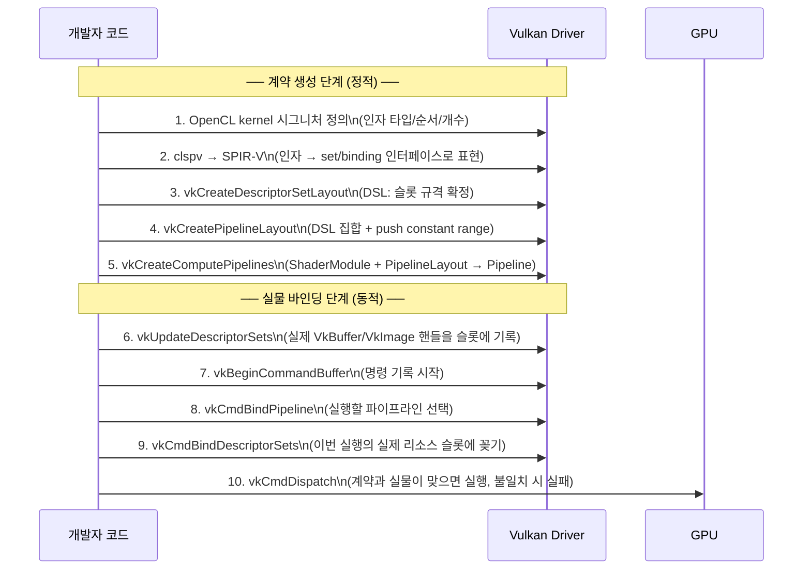

OpenCL → clspv/SPIR-V → Vulkan 실행 흐름을 **"계약 생성"**과 **"실물 바인딩"** 두 단계로 나눠 10줄로 요약한다.

---

## 10단계 타임라인



---

## 핵심 구분: create vs bind/dispatch

| 단계 | 성격 | 내용 |
|------|------|------|
| 1~5 | **정적 (create)** | "형식/계약" 확정 — 런타임 변경 없음 |
| 6~9 | **동적 (bind)** | "실물 대입" — 매 실행마다 다른 버퍼 사용 가능 |
| 10 | **실행** | 계약과 실물이 일치해야 성공 |

---

## 왜 pipeline create 성공 후에도 runtime mismatch가 발생하나?

- create 단계 성공 = 규격서 자체는 논리적으로 일관됨
- runtime 실패 = 실물 바인딩이 규격서와 불일치

```
예시:
  DSL: b0 = StorageBuffer, b1 = StorageBuffer
  실제 바인딩: b0 = UniformBuffer  ← 타입 불일치 → dispatch 실패
```

create 단계에서는 "실물이 뭐가 들어올지" 알 수 없다.  
따라서 불일치는 bind/validation/dispatch 시점에만 드러난다.

---

## 이해 확인 질문

### Q1. 10단계 중 "계약 생성"과 "실물 바인딩"의 경계는 어디인가?

<details>
<summary>정답 보기</summary>

단계 5(`vkCreateComputePipelines`)까지가 계약 생성.  
단계 6(`vkUpdateDescriptorSets`)부터가 실물 바인딩.

</details>

### Q2. `vkCmdDispatch` 전에 반드시 완료되어야 하는 bind 2개는?

<details>
<summary>정답 보기</summary>

1. `vkCmdBindPipeline` — 어떤 셰이더/연산을 실행할지
2. `vkCmdBindDescriptorSets` — 어떤 리소스(버퍼)를 쓸지

</details>

### Q3. pipeline create 성공 후에도 dispatch가 실패할 수 있는 이유는?

<details>
<summary>정답 보기</summary>

create 단계는 규격서의 논리적 일관성만 검증한다.  
실제 실행 시 바인딩되는 버퍼의 타입/크기가 규격서와 불일치하면  
validation layer 또는 드라이버가 dispatch 시점에 실패를 감지한다.

</details>

### Q4. descriptor set의 slot에 실제 버퍼를 "꽂는" 단계는?

<details>
<summary>정답 보기</summary>

단계 6: `vkUpdateDescriptorSets`  
실제 `VkBuffer` / `VkImage` 핸들을 각 binding 슬롯에 기록하는 단계.

</details>

---

## 관련 글

- [SPIR-V↔Vulkan 매핑](/opencl-note-spirv-vulkan-mapping/) — 1~5단계의 이론적 배경
- [Layout 호환성](/opencl-note-layout-compat/) — 계약이 왜 필요한가
- [종합 다이어그램](/opencl-note-final-map/) — 전체 경로 한 장 정리

## 관련 용어

[[descriptor-set]], [[pipeline-layout]], [[command-buffer]], [[SPIR-V]]
