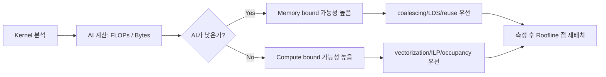

GPU 최적화를 할 때 가장 자주 막히는 지점은 "지금 이 커널이 compute bound인지 memory bound인지"를 감으로만 판단하는 순간이다.
오늘 노트는 그 감을 수치로 바꾸는 **Roofline 모델**의 최소 실전 버전을 정리한다.

## 왜 지금 Roofline인가

최근에 memory coalescing, occupancy, wavefront를 따로 학습했는데, 실제 튜닝 순서를 정할 기준이 부족했다.
Roofline은 이 조각들을 한 그림으로 묶어 "어디를 먼저 고쳐야 하는지"를 결정하게 해준다.

## 핵심 개념 3개

1. **Arithmetic Intensity (AI)** = FLOPs / Bytes
2. **Memory Roof** = Peak Memory Bandwidth × AI
3. **Compute Roof** = Peak Compute Throughput

실제 성능은 항상 아래 조건을 따른다.

\[
P_{attainable} \le \min(\text{Peak FLOPs},\ \text{BW}\times AI)
\]

즉,
- AI가 낮으면 `BW × AI`가 작아서 memory roof에 막히고
- AI가 충분히 높아지면 compute roof에 가까워진다.

## Roofline 그림으로 보기





## OpenCL 커널에 적용하는 4단계

### 1) 커널 단위 FLOPs 추정
- FMA 1회는 보통 2 FLOPs로 계산
- 분기 안쪽은 평균 실행 비율(혹은 worst-case)로 따로 기록

### 2) 커널 단위 바이트 추정
- `__global` load/store 총량을 먼저 계산
- 캐시 hit는 초기에 무시하고 상한 추정으로 시작

### 3) 디바이스 peak 값 확보
- Peak BW (GB/s), Peak FLOPs (TFLOP/s)
- 같은 GPU라도 클럭/전력 상태에 따라 실측 피크는 달라질 수 있음

### 4) 실측 점 찍고 병목 판정
- x축: AI
- y축: 측정 성능(GFLOP/s)
- 점이 memory roof 근처면 메모리 최적화부터, compute roof 근처면 연산 측 최적화부터 진행

<details>
<summary>전체 코드 보기 — roofline_quick_estimator.py</summary>

```python
# very rough estimator for one kernel launch
# inputs: flop_count, bytes_moved, peak_bw_gbs, peak_flops_gflops

def roofline_estimate(flop_count, bytes_moved, peak_bw_gbs, peak_flops_gflops):
    if bytes_moved <= 0:
        raise ValueError("bytes_moved must be > 0")

    ai = flop_count / bytes_moved  # FLOPs per Byte
    mem_roof = peak_bw_gbs * ai    # GB/s * FLOP/B = GFLOP/s
    attainable = min(peak_flops_gflops, mem_roof)

    if mem_roof < peak_flops_gflops:
        bound = "memory-bound"
    else:
        bound = "compute-bound"

    return {
        "AI": ai,
        "memory_roof_gflops": mem_roof,
        "compute_roof_gflops": peak_flops_gflops,
        "attainable_gflops": attainable,
        "likely_bound": bound,
    }
```

</details>

## 자주 하는 오판

- "occupancy가 낮으니 무조건 occupancy부터" → AI가 매우 낮으면 occupancy 개선보다 메모리 접근 개선이 먼저다.
- "LDS 썼으니 memory bound 탈출" → bank conflict가 크면 LDS 도입 효과가 거의 사라질 수 있다.
- "GFLOP/s만 높으면 됨" → 문제 크기/입출력 바이트가 바뀌면 같은 커널도 다른 roof로 이동한다.

## 빠른 체크리스트

- [ ] 이 커널의 FLOPs/Bytes를 한 줄로 적을 수 있다.
- [ ] 현재 GPU의 Peak BW, Peak FLOPs 숫자를 알고 있다.
- [ ] 내 커널 점이 memory roof 쪽인지 compute roof 쪽인지 말할 수 있다.
- [ ] 다음 튜닝 액션을 "메모리" 또는 "연산"으로 우선순위화했다.

---

## 관련 글

- [Memory coalescing 노트]()
- [GPU Occupancy 노트]()
- [Wavefront scheduling 노트]()

## 관련 용어

- [[roofline-model]], [[arithmetic-intensity]], [[memory-bandwidth]], [[compute-bound]], [[memory-bound]], [[occupancy]]
