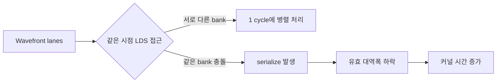

`__local` 메모리는 보통 "빠르다"고 배운다. 그런데 실제 커널 튜닝에서 `__local`로 옮겼는데도 성능이 거의 안 오르는 경우가 자주 나온다.
핵심 원인 중 하나가 **LDS bank conflict**다.

이번 글은 "왜 conflict가 생기고", "어떻게 확인하고", "코드에서 어떤 형태로 피하는지"를 OpenCL 관점에서 정리한다.

---

## LDS bank conflict란?

AMD 계열 기준으로 보면 LDS(Local Data Share)는 여러 개의 **bank**로 나뉘어 있다. 같은 cycle에 같은 wavefront lane들이 LDS를 읽을 때,
- 서로 **다른 bank**를 치면 병렬 처리되고,
- 여러 lane이 **같은 bank**를 치면 serialize(분할 처리)되면서 지연이 늘어난다.

즉, `__local` 자체가 빠른 게 아니라 **접근 패턴이 bank-friendly할 때만 빠르다**.



---

## 충돌이 잘 나는 패턴 vs 피하는 패턴

가장 흔한 실수는 2D 타일을 `tile[y][x]`로 둘 때, 다음 단계에서 lane들이 한 column으로 접근하는 케이스다.
이때 stride가 bank 개수와 나쁘게 맞물리면 conflict가 크게 난다.

<details>
<summary>전체 코드 보기 — transpose 타일 접근(충돌/완화 비교)</summary>

```c
#define TILE 32

__kernel void transpose_bad(__global float* in, __global float* out) {
    __local float tile[TILE][TILE];
    int lx = get_local_id(0), ly = get_local_id(1);
    int gx = get_global_id(0), gy = get_global_id(1);

    tile[ly][lx] = in[gy * get_global_size(0) + gx];
    barrier(CLK_LOCAL_MEM_FENCE);

    // column 접근: bank conflict 가능성 큼
    out[gx * get_global_size(1) + gy] = tile[lx][ly];
}

__kernel void transpose_padded(__global float* in, __global float* out) {
    __local float tile[TILE][TILE + 1]; // padding으로 stride 교란
    int lx = get_local_id(0), ly = get_local_id(1);
    int gx = get_global_id(0), gy = get_global_id(1);

    tile[ly][lx] = in[gy * get_global_size(0) + gx];
    barrier(CLK_LOCAL_MEM_FENCE);

    out[gx * get_global_size(1) + gy] = tile[lx][ly];
}
```

</details>

실전에서는 `+1 padding`이 bank mapping을 깨서 serialize를 줄이는 대표 기법이다.

---

## 단계별 점검 루틴 (실무용)

1. **증상 확인**
   - `__local` 도입했는데 기대 대비 속도 향상이 거의 없음
   - work-group 크기를 바꿀 때 성능이 들쭉날쭉함

2. **패턴 의심**
   - lane들이 row가 아니라 column/strided access를 하는지 확인
   - 타일 stride가 bank 개수와 충돌하기 쉬운 형태인지 체크

3. **빠른 실험**
   - `tile[H][W]` → `tile[H][W+1]` padding 적용
   - local size를 8x8, 16x16, 32x8 등으로 바꿔 재측정

4. **판단**
   - padding/shape 변경만으로 개선되면 bank conflict 가능성이 높다
   - 개선이 없다면 occupancy, global memory pattern(coalescing), register pressure를 다음 원인으로 본다

---

## 요약 체크리스트

- [ ] `__local`을 썼다는 이유만으로 빠르다고 가정하지 않는다.
- [ ] lane 접근이 같은 bank로 몰리는지(특히 column access) 먼저 본다.
- [ ] `W+1 padding`은 bank conflict 완화의 1순위 실험이다.
- [ ] local size와 데이터 배치를 함께 튜닝한다.

---

## 관련 글

- [Roofline 모델](/opencl-note-roofline-model/) — memory bound 판단 프레임
- [Memory coalescing 노트](/opencl-memory-coalescing-patterns/) — global memory 접근 패턴 최적화
- [GPU 메모리 계층 전체 지도](/gpu-memory-hierarchy/) — __private/__local/__global 큰 그림

## 관련 용어

- [[local-memory]], [[wavefront]], [[work-group]], [[NDRange]], [[barrier]]
