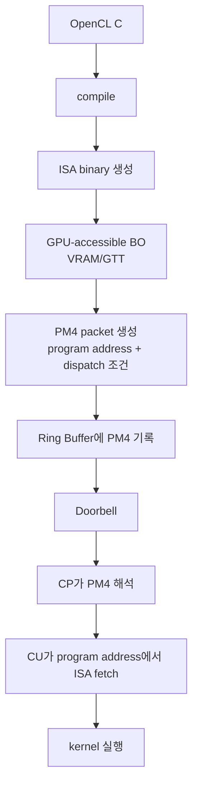

PM4와 ISA를 처음 같이 보면 자연스럽게 이런 그림을 떠올리기 쉽다.

~~~text
PM4 packet이라는 박스 안에 ISA가 들어 있다.
GPU는 그 박스를 열어서 안에 든 ISA를 실행한다.
~~~

나도 처음에는 이 모델로 이해했다.
PM4 dump도 binary처럼 보이고, ISA도 binary처럼 보인다.
둘 다 CPU가 아니라 GPU 쪽으로 넘어가는 것처럼 보이니, “PM4 packet이 ISA를 담는 container인가?”라고 생각하기 쉽다.

하지만 이 모델은 핵심에서 틀렸다.

**PM4 packet 안에 ISA가 들어있는 것이 아니다.**
ISA는 GPU가 접근 가능한 memory에 따로 올라가 있고, PM4는 그 ISA의 주소와 실행 조건을 GPU의 [[pm4-packet|Command Processor]]에게 전달하는 command packet이다.

## 왜 박스 비유가 자연스럽지만 부정확한가

초보자 입장에서 “PM4 packet = ISA를 담은 박스” 비유가 자연스러운 이유는 세 가지다.

첫째, 둘 다 binary처럼 보인다.

PM4 packet도 bitfield로 구성된 command stream이고, ISA도 기계어 bytes다.
사람이 보기에는 둘 다 hex dump로 보일 수 있다.

둘째, 둘 다 kernel 실행과 관련된다.

OpenCL kernel이 실행될 때 driver는 ISA도 준비하고 PM4도 만든다.
그래서 “kernel 실행에 필요한 모든 것이 PM4 안에 들어가나?”라고 생각하기 쉽다.

셋째, PM4 packet 이름에 dispatch가 들어간다.

`DISPATCH_DIRECT` 같은 이름을 보면 “이 packet이 kernel code 자체를 들고 있나?”라고 느낄 수 있다.
하지만 dispatch packet은 “code bytes를 운반하는 상자”라기보다 “이미 준비된 code를 어떤 조건으로 실행할지 지시하는 command”에 가깝다.

정확한 구분은 이것이다.

~~~text
PM4: CP가 읽는 command
ISA: CU가 실행하는 instruction
~~~

소비하는 하드웨어 블록이 다르다.
PM4는 Command Processor가 해석하고, ISA는 Compute Unit이 fetch해서 실행한다.

## 올바른 모델: ISA는 memory에 있고, PM4는 그 주소를 가리킨다

OpenCL C kernel을 AMD GPU에서 실행한다고 하자.
개념적으로는 이런 흐름을 탄다.

~~~text
OpenCL C source
-> compiler
-> GPU ISA binary
-> GPU-accessible memory의 BO(Buffer Object)에 업로드
-> PM4 packet 생성
-> Ring Buffer에 PM4 기록
-> Doorbell
-> CP가 PM4 해석
-> CU가 program address에서 ISA fetch
-> kernel 실행
~~~

여기서 ISA는 OpenCL C가 컴파일되어 만들어진 GPU machine code다.
예를 들어 `.pipe`에서 이런 줄을 볼 수 있다.

~~~asm
v_lshl_add_u32 v0, s10, 5, v0
~~~

이것은 실제 binary bytes를 사람이 읽을 수 있게 풀어 쓴 ISA disassembly에 가깝다.
GPU가 실제로 fetch하는 것은 이 문자열 자체가 아니라, 해당 instruction들이 encoding된 machine-code bytes다.

그 bytes는 GPU가 접근 가능한 memory에 올라간다.
AMD driver 관점에서는 보통 VRAM 또는 GTT에 있는 BO(Buffer Object)를 떠올릴 수 있다.
즉 ISA는 command packet 안에 들어가는 것이 아니라, GPU virtual address를 가진 memory object 안에 놓인다.

PM4 packet은 그 다음에 등장한다.
PM4는 대략 이런 정보를 command stream에 쓴다.

~~~text
shader program address = 0xA10000
dispatch size          = grid=(1024,1,1)
workgroup size         = local=(256,1,1)
resource/user data     = descriptor table, kernarg pointer, scratch/LDS state
dispatch trigger       = DISPATCH_DIRECT
~~~

핵심은 첫 줄이다.

~~~text
shader program address = 0xA10000
~~~

이 주소는 “ISA가 들어있는 memory 위치”를 가리킨다.
PM4 안에 ISA bytes가 통째로 들어있는 것이 아니다.

## 한 장 그림으로 보기

위 그림에서 중요한 점은 `ISA binary 생성 -> GPU-accessible BO`와 `PM4 packet 생성 -> Ring Buffer`가 다른 경로라는 점이다.

ISA는 실행할 code다.
PM4는 그 code를 실행시키기 위한 command다.



## PM4와 ISA의 차이

PM4와 ISA는 둘 다 “GPU로 전달되는 binary”처럼 보일 수 있다.
하지만 역할은 완전히 다르다.

### PM4는 CP가 읽는 명령이다

PM4는 GPU command stream이다.
CPU driver가 ring buffer에 PM4 packet들을 써두고 doorbell을 울리면, GPU의 CP(Command Processor)가 ring buffer를 읽는다.

CP는 PM4를 보고 이런 일을 한다.

~~~text
이 shader program address를 사용해라.
이 descriptor/resource state를 사용해라.
이 grid size로 dispatch해라.
끝나면 event/fence를 써라.
~~~

즉 PM4는 GPU 안의 실행 관리자에게 주는 command다.
실제 계산 instruction 하나하나를 CU처럼 실행하는 것이 아니다.

### ISA는 CU가 실행하는 명령이다

ISA는 shader/kernel의 machine code다.
CU(Compute Unit)는 CP가 설정해 둔 program address를 따라 memory에서 ISA instruction을 fetch한다.
그리고 wavefront 단위로 instruction을 실행한다.

예를 들어 `.pipe`에서 본 `v_lshl_add_u32 v0, s10, 5, v0` 같은 줄은 CU가 실행할 instruction을 사람이 읽을 수 있게 disassemble한 모습에 가깝다.
이것은 PM4 packet의 payload로 들어있는 설명문이 아니다.

정리하면 아래처럼 나눠야 한다.

| 구분 | PM4 | ISA |
|---|---|---|
| 누가 읽나 | CP(Command Processor) | CU(Compute Unit) |
| 무엇인가 | command packet / command stream | GPU machine code |
| 어디에 있나 | ring buffer의 command stream | GPU-accessible BO의 code 영역 |
| 핵심 내용 | program address, resource 설정, dispatch 조건 | 실제 arithmetic, memory load/store, branch |
| 비유 | 출고 전표 / 작업 명령서 | 실제 작업 지시서 또는 처리할 화물 |

## 택배 상자 비유를 고쳐 보기

기존의 “PM4 packet = 택배 상자” 비유는 이 지점에서 오해를 만든다.
그 비유에서는 GPU가 PM4 상자를 열고 그 안에서 ISA를 꺼내 실행하는 것처럼 느껴진다.

더 정확한 비유는 창고와 출고 전표다.

~~~text
ISA = 창고 선반에 미리 올려둔 실제 작업 지시서 또는 화물
PM4 = "몇 번 선반의 물건을 가져와서, 어떤 방식으로 처리하라"고 적힌 출고 전표
CP  = 출고 전표를 읽는 관리자
CU  = 실제 작업 지시서를 읽고 계산을 수행하는 작업자
~~~

예를 들어 창고 선반 `0xA10000`에 kernel ISA가 놓여 있다고 하자.
PM4 전표에는 이런 내용이 적힌다.

~~~text
선반 번호: 0xA10000
작업 크기: 1024개 item
작업반 크기: 256개 item씩
사용할 재료: descriptor table D42
시작 조건: wait-list dependency가 만족된 뒤
~~~

관리자인 CP는 이 전표를 읽고 작업 준비를 한다.
하지만 CP가 직접 작업 지시서의 모든 instruction을 실행하지는 않는다.
CP는 “어느 선반의 code를 실행할지”와 “어떤 resource/조건으로 실행할지”를 세팅한다.

그 다음 실제 작업자인 CU가 선반 `0xA10000`에서 ISA를 fetch해서 계산을 수행한다.

그래서 더 정확한 한 줄 비유는 이렇다.

~~~text
PM4는 택배 상자가 아니라 출고 전표다.
ISA는 그 전표 안에 들어있는 것이 아니라, 전표가 가리키는 창고 선반에 있다.
~~~

## OpenCL driver 관점의 흐름

이제 OpenCL driver/UMD/KMD 관점으로 다시 쓰면 흐름이 더 명확해진다.

### 1. UMD가 OpenCL C를 컴파일한다

OpenCL runtime 또는 UMD(User Mode Driver)는 OpenCL C source를 컴파일한다.
중간에 LLVM IR, SPIR-V, backend IR 같은 단계가 있을 수 있지만, AMD GPU에서 실행하려면 최종적으로 GPU ISA/code object가 필요하다.

이 code object에는 instruction bytes만 있는 것이 아니다.
대개 실행에 필요한 metadata도 같이 있다.

~~~text
code object:
  - ISA binary
  - entry point
  - SGPR/VGPR usage
  - LDS usage
  - scratch/private memory usage
  - kernel argument layout
  - user data mapping
~~~

### 2. UMD/KMD가 GPU-accessible BO를 준비한다

ISA를 CPU process의 일반 memory에만 두면 GPU가 실행할 수 없다.
GPU가 접근 가능한 address space에 code를 올려야 한다.

그래서 UMD/KMD는 GPU-accessible BO를 준비한다.
이 BO는 VRAM에 있을 수도 있고, GTT처럼 GPU가 접근 가능한 system memory 영역일 수도 있다.

중요한 것은 이 BO가 GPU virtual address를 갖는다는 점이다.

~~~text
code BO:
  gpu_va = 0xA10000
  contents = ISA binary bytes
~~~

### 3. ISA binary를 BO에 업로드한다

컴파일된 ISA binary bytes를 이 BO에 복사한다.
이제 GPU는 `0xA10000` 같은 program address를 통해 kernel code를 fetch할 수 있다.

여기까지가 “실제 실행할 code를 GPU memory에 올리는 단계”다.
아직 dispatch가 시작된 것은 아니다.

### 4. PM4 packet을 만든다

이제 driver는 dispatch를 위한 PM4 command stream을 만든다.
PM4에는 ISA bytes 전체가 들어가는 것이 아니라, 실행에 필요한 state와 pointer가 들어간다.

예를 들어 compute dispatch 주변에는 개념적으로 이런 값들이 필요하다.

~~~text
PM4 state / dispatch:
  shader program address = 0xA10000
  dispatch size          = groups=(4,1,1)
  workgroup size         = local=(256,1,1)
  kernarg pointer        = 0xB00000
  descriptor table       = 0xC00000
  scratch/LDS/resource   = metadata 기반 설정
  dispatch command       = DISPATCH_DIRECT 계열
~~~

세대마다 실제 packet 이름과 register 이름은 달라질 수 있다.
하지만 driver-debug 관점의 invariant는 같다.

**PM4는 실행할 code의 주소와 실행 조건을 CP에게 알려준다.**

### 5. PM4를 ring buffer에 기록하고 doorbell을 울린다

UMD/KMD는 PM4 packet들을 ring buffer에 기록한다.
그리고 doorbell을 통해 GPU에게 “새 command가 있다”고 알린다.

~~~text
CPU driver:
  ring[wptr++] = SET_SHADER_PROGRAM_ADDRESS(0xA10000)
  ring[wptr++] = SET_RESOURCE_STATE(...)
  ring[wptr++] = DISPATCH_DIRECT(groups=(4,1,1))
  doorbell = new_wptr
~~~

여기서 ring buffer의 내용은 CP가 소비할 command stream이다.
ISA code BO와 ring buffer는 역할이 다르다.
위 pseudo-code의 packet/register 이름은 개념 설명용이다. 실제 AMD 세대별 PM4에서는 program address나 resource state가 여러 register write와 dispatch packet 조합으로 나타날 수 있다.

### 6. CP가 PM4를 읽고 dispatch를 시작한다

Doorbell 이후 CP는 ring buffer에서 PM4 packet을 읽는다.
CP는 packet을 해석하면서 compute state를 설정하고 dispatch를 시작한다.

~~~text
CP:
  read PM4 from ring
  set shader program address = 0xA10000
  set resource/user data state
  launch dispatch
~~~

이 시점에도 CP가 ISA instruction을 하나씩 실행하는 것은 아니다.
CP는 실행 환경을 준비하고 dispatch를 트리거한다.

### 7. CU가 program address에서 ISA를 fetch해서 kernel을 실행한다

마지막으로 CU가 wavefront를 실행한다.
CU는 설정된 program address에서 instruction을 fetch한다.

~~~text
CU:
  fetch instruction from 0xA10000
  execute v_lshl_add_u32 ...
  execute memory load/store ...
  execute branch/barrier-related instructions ...
~~~

즉 `.pipe`에서 보는 ISA disassembly는 이 단계의 instruction을 사람이 읽은 것이다.
PM4 packet dump와 ISA disassembly를 같이 보면 둘 다 낮은 수준처럼 보이지만, 하나는 CP용 command이고 다른 하나는 CU용 code다.

## 작은 디버깅 예시

만약 kernel이 엉뚱한 code를 실행하거나 GPU fault가 난다면, 아래 두 질문을 분리해야 한다.

첫째, ISA BO 자체가 맞는가?

~~~text
code BO gpu_va = 0xA10000
code object = intended kernel?
entry offset = correct?
instruction bytes uploaded?
~~~

둘째, PM4가 그 code를 올바르게 가리켰는가?

~~~text
PM4 shader program address = 0xA10000?
dispatch packet 전에 program address state가 설정됐는가?
resource/user data/kernarg pointer가 같은 kernel ABI와 맞는가?
ring order가 dispatch 전에 state setup을 보장하는가?
~~~

이 둘을 섞으면 “PM4 안의 ISA가 잘못됐다” 같은 모호한 설명이 된다.
더 정확히는 이렇게 말해야 한다.

~~~text
ISA BO에 올라간 code가 잘못됐는가?
아니면 PM4가 잘못된 program address/state를 설정했는가?
~~~

이 구분은 PM4 dump와 ISA dump를 같이 볼 때 특히 중요하다.

## what this means for driver dev

드라이버 관점에서 이 모델은 다음 체크리스트로 이어진다.

- UMD가 OpenCL C를 컴파일해서 ISA/code object를 얻는다.
- UMD/KMD가 GPU-accessible BO를 준비한다.
- ISA binary를 그 BO에 업로드하고 GPU virtual address를 확보한다.
- PM4 packet에는 ISA 자체가 아니라 shader program address, dispatch size, workgroup size, resource/user data 설정이 들어간다.
- PM4는 ring buffer에 기록되고 doorbell로 GPU에게 알린다.
- GPU CP가 PM4를 읽고 dispatch state를 설정한다.
- CU가 PM4에 설정된 program address에서 ISA를 fetch해서 kernel을 실행한다.

따라서 driver log도 두 축을 분리해서 남기는 것이 좋다.

~~~text
code axis:
  kernel=saxpy
  code_object_id=K17
  code_bo=BO9
  code_gpu_va=0xA10000
  entry_offset=0x0

command axis:
  submit=42
  ring=wptr 0x3500..0x35a0
  pm4_program_address=0xA10000
  dispatch_groups=(4,1,1)
  workgroup_size=(256,1,1)
  descriptor_table=0xC00000
  kernarg=0xB00000
~~~

이렇게 나누면 “code가 틀린 문제”와 “command가 code를 잘못 가리킨 문제”를 분리해서 볼 수 있다.

## app-facing takeaway

앱 개발자는 PM4 packet을 직접 만들지 않는다.
하지만 이 모델은 OpenCL 성능과 오류를 해석할 때 도움이 된다.

`clBuildProgram`이나 first-run 시점에는 source가 ISA/code object로 바뀌고 GPU memory에 준비되는 비용이 보일 수 있다.
`clEnqueueNDRangeKernel` 시점에는 이미 준비된 code object를 어떤 argument/resource/work size로 실행할지 command stream을 만드는 비용이 보일 수 있다.

즉 “kernel 실행”이라고 한 번에 말하지만 내부에는 두 축이 있다.

~~~text
code 준비 축: OpenCL C -> ISA binary -> GPU memory BO
실행 지시 축: PM4 -> ring buffer -> CP -> CU fetch/execute
~~~

이 둘을 분리해서 보면 PM4와 ISA의 관계가 훨씬 덜 헷갈린다.

## 한 문장 요약

**PM4는 ISA를 담는 상자가 아니라, 이미 GPU memory에 올라간 ISA를 실행시키기 위한 주소와 실행 조건을 담은 명령서다.**

---

## 관련 글

- [OpenCL 드라이버의 kernel dispatch ABI: ISA 메타데이터가 PM4 DISPATCH를 채우는 방식]()
- [PM4 compute dispatch sequence: state setup은 왜 DISPATCH보다 먼저 와야 하나]()
- [OpenCL 드라이버의 ring buffer와 doorbell: submit이 GPU 실행으로 바뀌는 경계]()
- [SPIR-V에서 ISA까지: 드라이버 백엔드가 실제로 하는 일]()

## 관련 용어

- [[pm4-packet]], [[SPIR-V]], [[command-queue]], [[wavefront]]
