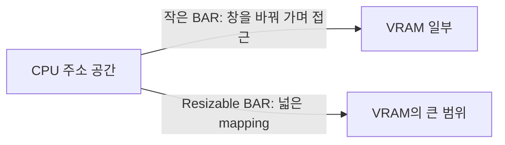

거대한 창고가 있는데, 물건을 꺼내는 창구는 작은 미닫이창 하나뿐이라고 해 보자. 창고 안 물건은 많아도 직원은 지금 창에 걸린 구역만 볼 수 있다. 다른 구역이 필요하면 창이 가리키는 범위를 바꿔야 한다. 오랫동안 CPU가 discrete GPU의 VRAM을 다루던 모습도 이와 닮았다.

여기서 창고는 VRAM, 직원은 CPU, 미닫이창은 PCI Express의 **BAR(Base Address Register)**다. BAR는 GPU 같은 PCIe device의 memory 영역을 CPU 주소 공간에 보이게 하는 통로다. 전통적인 PC 구성에서는 VRAM 전체보다 작은 범위만 한 번에 mapping되는 경우가 흔했다. **Resizable BAR**는 이름 그대로 이 주소 창의 크기를 platform이 더 크게 협상할 수 있게 하며, 지원 조합에서는 CPU가 GPU frame buffer의 훨씬 넓은 범위—때로는 전체—에 접근할 수 있게 한다.

왜 재미있을까? GPU가 빨라진 것이 아니라 **같은 VRAM을 바라보는 주소 창의 계약**이 달라진 것이다. 큰 game asset이나 여러 transfer를 다룰 때 mapping 전환과 잘게 나뉜 접근 부담을 줄일 여지가 생긴다. 그래서 AMD는 이를 Smart Access Memory라는 이름으로 알렸고, NVIDIA도 GeForce RTX 30 시기에 지원을 확대했다.

다만 큰 창이 곧 더 빠른 창은 아니다. PCIe bandwidth와 latency 자체가 늘어나는 기능은 아니며, 효과는 workload와 driver에 따라 달라진다. CPU·motherboard firmware·GPU VBIOS·driver가 모두 이 기능을 지원해야 한다는 점도 창고 비유가 놓치는 부분이다.

Source note: [NVIDIA의 Resizable BAR 설명](https://www.nvidia.com/en-us/geforce/news/geforce-rtx-30-series-resizable-bar-support/)은 이를 optional PCI Express 기술로 소개하며, CPU가 전체 frame buffer에 효율적으로 접근하고 여러 요청을 동시에 처리할 수 있다고 설명한다. 또한 CPU, motherboard, SBIOS, GPU VBIOS, driver의 호환성이 필요하다고 명시한다.
